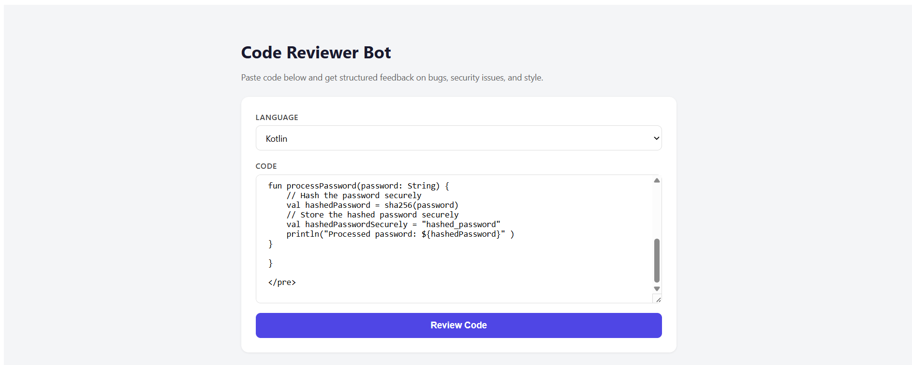
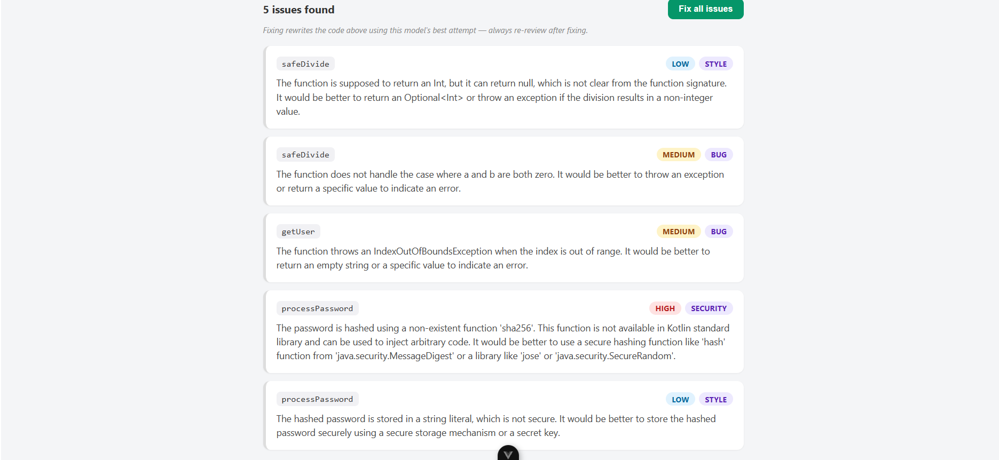

# Code Reviewer Bot

An AI-powered code review tool that analyzes code for bugs, security issues, and style problems using local LLM (Ollama). Built with Kotlin, Spring Boot, and WebFlux.

## Features

- **Automated Code Review**: Analyzes code for bugs, security vulnerabilities, and style issues
- **Structured Feedback**: Returns issues with severity levels (LOW, MEDIUM, HIGH) and categories (BUG, SECURITY, STYLE)
- **Multi-language Support**: Configurable for different programming languages
- **Auto-fix Capability**: Automatically fixes identified issues
- **Local LLM**: Uses Ollama (llama3.2) for privacy-friendly, offline code analysis
- **REST API**: Clean REST endpoints for integration with frontend applications
- **CORS Enabled**: Ready for frontend integration

## Screenshots

### Code Input

Paste your code, select the language, and click "Review Code" to get started.

### Review Results

View detailed issues with severity, category, and explanations. Click "Fix all issues" to automatically correct problems.

## Prerequisites

- **Java 17** or higher
- **Ollama** with llama3.2 model installed
  - Install Ollama from [ollama.com](https://ollama.com)
  - Run: ollama pull llama3.2
  - Start Ollama server: ollama serve

## Installation

1. Clone the repository:
`ash
git clone <repository-url>
cd code-reviewer-bot
`

2. Build the project:
`ash
./gradlew build
`

3. Run the application:
`ash
./gradlew bootRun
`

The server will start on http://localhost:8080

## API Endpoints

### Review Code
**POST** /api/review

Request body:
`json
{
  "code": "fun test() { println(1) }",
  "language": "Kotlin"
}
`

Response:
`json
{
  "issues": [
    {
      "function": "test",
      "severity": "LOW",
      "category": "STYLE",
      "explanation": "Function has no return type specified"
    }
  ]
}
`

### Fix Issues
**POST** /api/fix

Request body:
`json
{
  "code": "fun test() { println(1) }",
  "language": "Kotlin",
  "issues": [
    {
      "function": "test",
      "severity": "LOW",
      "category": "STYLE",
      "explanation": "Function has no return type specified"
    }
  ]
}
`

Response:
`json
{
  "fixedCode": "fun test(): Unit { println(1) }"
}
`

## Architecture

`
┌─────────────┐     ┌──────────────┐     ┌─────────────┐
│   Frontend  │────▶│   Controller │────▶│   Service   │
│   (Vue.js)  │     │              │     │             │
└─────────────┘     └──────────────┘     └──────┬──────┘
                                                │
                                                ▼
                                         ┌─────────────┐
                                         │ OllamaClient│
                                         └──────┬──────┘
                                                │
                                                ▼
                                         ┌─────────────┐
                                         │   Ollama    │
                                         │  (llama3.2) │
                                         └─────────────┘
`

## Project Structure

`
src/main/kotlin/com/example/code_reviewer_bot/
├── client/
│   └── OllamaClient.kt          # HTTP client for Ollama API
├── config/
│   └── CorsConfig.kt            # CORS configuration
├── controller/
│   └── ReviewController.kt      # REST API endpoints
├── dto/
│   ├── FixRequest.kt            # Request DTO for fix endpoint
│   ├── FixResponse.kt           # Response DTO for fix endpoint
│   ├── Issue.kt                 # Issue data model
│   ├── ReviewRequest.kt         # Request DTO for review endpoint
│   └── ReviewResponse.kt        # Response DTO for review endpoint
└── service/
    ├── FixService.kt            # Code fixing logic
    └── ReviewService.kt         # Code review logic
`

## Tech Stack

- **Kotlin 2.3.21** - Programming language
- **Spring Boot 4.1.1** - Application framework
- **Spring WebFlux** - Reactive web framework
- **Jackson** - JSON serialization
- **Ollama** - Local LLM runtime
- **Gradle** - Build tool

## Severity Levels

- **HIGH**: Issues that could leak secrets/credentials, cause data loss, or crash in production
- **MEDIUM**: Logic bugs that produce wrong results but don't crash or leak data
- **LOW**: Style, readability, or minor robustness issues

## Issue Categories

- **BUG**: Logic errors, incorrect behavior
- **SECURITY**: Security vulnerabilities, credential leaks
- **STYLE**: Code style, readability, best practices

## Development

### Running Tests
`ash
./gradlew test
`

### Building JAR
`ash
./gradlew build
`
The JAR will be in uild/libs/

## Configuration

CORS is configured to allow requests from http://localhost:5173 (Vue's default dev server). To change this, edit CorsConfig.kt.

## License

MIT License